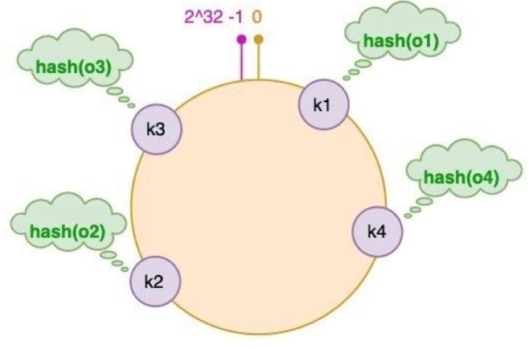

本文将介绍如何基于Go语言实现一个简单的LRU（Least Recently Used，最近最少使用）缓存，并展示如何在客户端和服务端之间进行交互。相关源代码可以在[GitHub仓库](https://github.com/wuwuhechen/GO-study/tree/main/LRU)中找到。

# LRU缓存实现
## 原理
LRU缓存也称为最近最少使用缓存，是一种常见的缓存淘汰策略。当缓存达到容量限制时，LRU会淘汰最近最少使用的项。实现LRU缓存通常需要使用双向链表和哈希表来实现高效的插入、删除和访问操作。

## 数据结构设计
### 需求分析
1. **添加数据**：当添加新数据时，如果缓存已满，需要淘汰最近最少使用的数据。
2. **访问数据**：当访问数据时，需要更新该数据的使用状态，使其成为最近使用的数据。
3. **删除数据**：当需要删除数据时，应该能够高效地删除指定的数据。

### 设计方案
根据上述需求分析，为了实现访问数据的高效性，我们可以使用一个哈希表来存储数据的键值对，这样根据某个key可以快速访问到对应的值，实现了数据库常数时间的访问。

为了实现快速定位最近最少使用的数据，自然可以想到使用队列来存储使用顺序，这可以使得添加和淘汰的时间复杂度为O(1)。但是，单纯使用队列会导致访问数据时需要遍历队列来更新使用状态，这样会增加时间复杂度。为了方便管理使用状态，我们可以使用双向链表来存储数据的使用顺序，这样在访问数据时可以快速地将其移动到链表的头部，表示它是最近使用的数据。

为了确定缓存的容量，我们需要一个变量来记录当前已使用的内存大小，以及一个变量来记录允许使用的最大内存大小。当添加新数据时，如果当前已使用的内存加上新数据的大小超过了最大内存限制，我们就需要淘汰最近最少使用的数据，直到有足够的空间来添加新数据。

## 代码实现
### 定义数据结构
综合上述分析，我们便能定义出LRU缓存的数据结构如下：
```go
type Cache struct {
	maxBytes  int64
	nbytes    int64
	ll        *list.List
	cache     map[string]*list.Element
    // 为了了在淘汰数据时能够执行一些额外的操作，我们可以定义一个回调函数，当数据被淘汰时会调用这个函数。
	OnEvicted func(key string, value Value) 
}
```

为了实现通用性，我们的缓存需要支持存储任意类型的数据，对于内存而言，只需要知道其大小，因此我们可以定义一个接口来表示缓存中存储的值：
```go
type Value interface {
	Len() int
}
```

为了方便数据的删除，我们可以定义一个结构体来表示链表中的节点：
```go
type entry struct {
    key   string
    value Value
}
```

为了方便进行实例化，我们可以定义一个构造函数来创建LRU缓存：
```go
func New(maxBytes int64, onEvicted func(string, Value)) *Cache {
	return &Cache{
		maxBytes:  maxBytes,
		ll:        list.New(),
		cache:     make(map[string]*list.Element),
		OnEvicted: onEvicted,
	}
}
```

### 实现查找功能
当我们需要查找数据时，我们首先需要在哈希表中查找对应的key，如果找到了对应的元素，我们需要将其移动到链表的头部，表示它是最近使用的数据。最后返回对应的值。
```go
func (c *Cache) Get(key string) (value Value, ok bool) {
	if ele, ok := c.cache[key]; ok {
		c.ll.MoveToFront(ele)
		kv := ele.Value.(*entry)
		return kv.value, true
	}
	return
}
```

:::caution
在上面代码中，我们使用类型断言将链表中的元素转换为我们定义的entry结构体，以便访问其中的key和value。
:::

### 实现删除功能
事实上，一个缓存除了在结束时需要完全清除数据之外，并不会提供删除单个数据的功能，这里的删除实际上是缓存淘汰的过程，即删除最近最少使用的数据。当我们需要淘汰数据时，我们可以从链表的尾部获取最近最少使用的数据，然后将其从链表和哈希表中删除，并更新当前已使用的内存大小。
```go
func (c *Cache) Remove() {
	ele := c.ll.Back()

	if ele != nil {
		c.ll.Remove(ele)
		kv := ele.Value.(*entry)
		delete(c.cache, kv.key)
		c.nbytes -= int64(len(kv.key)) + int64(kv.value.Len())
		if c.OnEvicted != nil {
			c.OnEvicted(kv.key, kv.value)
		}
	}
}
```

### 实现新增与修改
当我们需要新增或修改数据时，我们首先需要检查该数据是否已经存在，如果存在，我们需要更新其值，并将其移动到链表的头部，表示它是最近使用的数据。如果不存在，我们需要创建一个新的entry结构体，并将其添加到链表的头部，同时在哈希表中添加对应的key和元素。最后，我们需要检查当前已使用的内存大小是否超过了最大内存限制，如果超过了，我们需要淘汰最近最少使用的数据，直到有足够的空间来添加新数据。
```go
func (c *Cache) Add(key string, value Value) {
    // 计算新增数据所需的内存大小
	need := int64(len(key)) + int64(value.Len())

    // 如果新增数据所需的内存大小超过了最大内存限制，我们就无法添加该数据，因此直接返回
	if need > c.maxBytes {
		return
	}

    // 如果该数据已经存在，我们需要计算更新后的所需内存大小
	if ele, ok := c.cache[key]; ok {
		kv := ele.Value.(*entry)
		need = int64(value.Len()) - int64(kv.value.Len())
	}

    // 检查是否能够存储
	for c.maxBytes != 0 && c.nbytes+need > c.maxBytes {
		c.Remove()
	}

	if ele, ok := c.cache[key]; ok {
		c.ll.MoveToFront(ele)
		kv := ele.Value.(*entry)
		c.nbytes += need
		kv.value = value
	} else {
		ele := c.ll.PushFront(&entry{key, value})
		c.cache[key] = ele
		c.nbytes += need
	}
}
```

# 实现单机并发LRU缓存
在上面的实现中，我们的LRU缓存并没有考虑并发访问的情况。在实际应用中，缓存通常会被多个goroutine同时访问，因此我们需要对LRU缓存进行并发控制，以确保数据的一致性和安全性。

## 抽象缓存值数据结构
为了实现对于不同类型数据的支持，我们可以定义一个抽象的缓存值数据结构，来表示缓存中存储的数据。考虑到数据的编码方式，可以使用byte数组来表示缓存中的值，这样可以支持任意类型的数据，只要能够将其编码为byte数组即可。

### 定义缓存值数据结构
我们可以定义一个结构体来表示缓存中的值，该结构体包含一个byte数组来表示数据的内容：

```go
type ByteView struct {
	b []byte
}
```

### 实现缓存值接口
为了使ByteView能够作为缓存中的值，我们需要实现Value接口中的Len方法，该方法返回缓存值的大小：

```go
func (v ByteView) Len() int {
	return len(v.b)
}
```

### 定义外部访问接口
因为缓存是只读的，我们需要定义一个外部访问接口来获取缓存中的数据：

```go
func (v ByteView) ByteSlice() []byte {
	return cloneBytes(v.b)
}

// 确保返回的byte数组是一个副本，以防止外部修改缓存中的数据
func cloneBytes(b []byte) []byte {
	c := make([]byte, len(b))
	copy(c, b)
	return c
}
```

### 实现格式化输出
为了方便调试和查看缓存中的数据，我们可以实现一个格式化输出的方法：

```go
func (v ByteView) String() string {
    return string(v.b)
}
```

## 并发控制
为了实现LRU缓存的并发控制，我们可以使用sync.RWMutex来保护缓存的数据结构，确保在读写操作时能够正确地进行同步。

### 定义并发安全的LRU缓存
我们可以重新定义一个结构体，并在其中包含同步机制来表示并发安全的LRU缓存：

```go
type cache struct {
	mu         sync.Mutex
	lru        *lru.Cache
	cacheBytes int64
}
```
在这个结构体中，我们使用sync.Mutex来保护LRU缓存的数据结构，确保在读写操作时能够正确地进行同步。

### 实现并发安全的Get方法
在Get方法中，我们需要先获取锁，然后进行数据的访问操作，最后释放锁：

```go
func (c *cache) get(key string) (value ByteView, ok bool) {
	c.mu.Lock()
	defer c.mu.Unlock()
	if c.lru == nil {
		return
	}
	if v, ok := c.lru.Get(key); ok {
		return v.(ByteView), ok
	}

	return
}
```

### 实现并发安全的Add方法
在Add方法中，我们同样需要获取锁，然后进行数据的添加操作，最后释放锁：

```go
func (c *cache) add(key string, value ByteView) {
	c.mu.Lock()
	defer c.mu.Unlock()
	if c.lru == nil {
		c.lru = lru.New(c.cacheBytes, nil)
	}
	c.lru.Add(key, value)
}
```

## 主体结构
### 源数据的获取
从源头获取数据的方式应该该是一个抽象的接口，这样我们就可以根据实际情况来实现不同的数据获取方式，例如从数据库中获取数据，或者从文件中获取数据等。我们可以定义一个接口来表示数据获取的方式：

```go
package kizzcache

type Getter interface {
	Get(key string) ([]byte, error)
}

type GetterFunc func(key string) ([]byte, error)

func (f GetterFunc) Get(key string) ([]byte, error) {
	return f(key)
}
```

:::caution
在上面的代码中，我们通过使用接口型函数来实现了数据获取的抽象，这样我们就可以根据实际情况来实现不同的数据获取方式。既可以通过实现Getter接口来获取数据，也可以直接使用GetterFunc类型来获取数据，这样就提供了很大的灵活性。
:::

### 定义主体结构
我们可以定义一个主体结构来表示整个LRU缓存系统，该结构包含一个并发安全的LRU缓存，以及一个数据获取的接口：

```go 
type Group struct {
	name      string
	getter    Getter
	mainCache cache
	peers     PeerPicker
	loader    *singleflight.Group
}

// 全局的Group实例，key是Group的名字
var (
	mu     sync.RWMutex
	groups = make(map[string]*Group)
)

```

### 实现主体结构的构造函数
我们可以定义一个构造函数来创建一个新的Group实例，同时为了实现快速访问特定Group，我们将Group实例存储在一个全局的map中：

```go
func NewGroup(name string, cacheBytes int64, getter Getter) *Group {
	if getter == nil {
		panic("nil Getter")
	}
	mu.Lock()
	defer mu.Unlock()
	g := &Group{
		name:      name,
		getter:    getter,
		mainCache: cache{cacheBytes: cacheBytes},
	}
	groups[name] = g
	return g
}
```

### 实现主体结构的访问方法
在Group结构中，我们需要实现一个访问方法来获取缓存中的数据，如果缓存中没有对应的数据，我们需要从数据获取接口中获取数据，并将其添加到缓存中，在该部分中，我们暂时只实现单机版本的访问方法，后续我们会实现分布式版本的访问方法：

```go
// Get方法首先会尝试从缓存中获取数据，如果缓存中没有对应的数据，我们就需要调用load方法来从数据获取接口中获取数据，并将其添加到缓存中。
func (g *Group) Get(key string) (ByteView, error) {
	if key == "" {
		return ByteView{}, fmt.Errorf("key is required")
	}

	if v, ok := g.mainCache.get(key); ok {
		log.Println("[GeeCache] hit")
		return v, nil
	}

	return g.load(key)
}

// 暂时只实现本地读取，后续我们会实现分布式版本的读取
func (g *Group) load(key string) (value ByteView, err error) {
	return g.getLocally(key)
}

// 从本地获取数据
func (g *Group) getLocally(key string) (ByteView, error) {
	bytes, err := g.getter.Get(key)
	if err != nil {
		return ByteView{}, err

	}
	value := ByteView{b: cloneBytes(bytes)}
	g.populateCache(key, value)
	return value, nil
}

// 将数据添加到缓存中
func (g *Group) populateCache(key string, value ByteView) {
	g.mainCache.add(key, value)
}
```

# 实现HTTP服务端
分布式版本的LRU缓存需要实现一个HTTP服务端来处理来自客户端的请求，并返回对应的数据。我们可以使用Go语言内置的net/http包来实现HTTP服务端。

## 定义HTTP服务端结构
为了实现节点间的通信，我们需要定义一个结构体HTTPPool来表示HTTP服务端，该结构体包含一个HTTP服务器，以及一个用于存储节点信息的map：

```go
type HTTPPool struct {
	self     string
	basePath string
}
```

## 实现HTTP服务端的构造函数
我们可以定义一个构造函数来创建一个新的HTTPPool实例：
```go
func NewHTTPPool(self string) *HTTPPool {
	return &HTTPPool{
		self:     self,
		basePath: defaultBasePath,
	}
}
```

## 实现信息打印
为了方便调试和查看HTTP服务端的状态，我们可以实现一个信息打印的方法：

```go
func (p *HTTPPool) Log(format string, v ...interface{}) {
	log.Printf("[Server %s] %s", p.self, fmt.Sprintf(format, v...))
}
```

## 实现HTTP服务端的ServeHTTP方法
为了区分不同的HTTP请求，我们可以在ServeHTTP方法中解析请求的URL路径，并根据路径来处理不同的请求：

```go
func (p *HTTPPool) ServeHTTP(w http.ResponseWriter, r *http.Request) {
    // 判断是否满足条件
	if !strings.HasPrefix(r.URL.Path, p.basePath) {
		panic("HTTPPool serving unexpected path: " + r.URL.Path)
	}
	p.Log("%s %s", r.Method, r.URL.Path)

    // 解析请求的URL路径，获取groupName和key
	parts := strings.SplitN(r.URL.Path[len(p.basePath):], "/", 2)
	if len(parts) != 2 {
		http.Error(w, "bad request", http.StatusBadRequest)
		return
	}

	groupName := parts[0]
	key := parts[1]

	group := GetGroup(groupName)
	if group == nil {
		http.Error(w, "no such group: "+groupName, http.StatusNotFound)
		return
	}

	view, err := group.Get(key)
	if err != nil {
		http.Error(w, err.Error(), http.StatusInternalServerError)
		return
	}

    // 将获取到的数据写入HTTP响应中
	w.Header().Set("Content-Type", "application/octet-stream")
	w.Write(view.ByteSlice())
}
```

# 实现一致性哈希算法
## 背景介绍
### 实现相同key映射到同一台机器
对于分布式缓存来说，如果访问一个节点但是这个节点上没有对应的数据，我们需要从其他节点获取数据。为了实现这一点，我们需要一个机制来确定某个key应该被存储在哪个节点上，我们自然而然可以想到使用哈希算法来实现这一点。通过对key进行哈希计算，我们可以得到一个哈希值，然后根据这个哈希值来确定该key应该被存储在哪个节点上。

### 哈希算法的局限性
虽然哈希算法能够实现将key映射到不同的节点上，但是当我们需要添加或删除节点时，可能会导致大量的key被重新映射到不同的节点上，导致几乎所有的key都需要被重新分配，这样会导致大量的数据迁移，增加系统的负担，极端条件下甚至可能导致**缓存雪崩**。

## 一致性哈希算法
### 基本原理
为了避免上述问题，我们可以使用一致性哈希算法来实现节点的分布式存储。一致性哈希算法的基本原理是将所有的节点和key都映射到一个环上，然后根据key的哈希值来确定该key应该被存储在哪个节点上。当我们需要添加或删除节点时，只需要重新映射少量的key到新的节点上，而不是重新映射所有的key，这样就能够避免大量的数据迁移，减少系统的负担。



根据上图可以发现，在新增或删除节点时，只有少量的key需要被重新映射到新的节点上，而不是重新映射所有的key，这样就能够避免大量的数据迁移，减少系统的负担。

### 虚拟节点
可以发现，如果服务器的节点过少，容易导致服务器节点在环上分布不均匀，可能会导致某些节点上存储的key过多，而某些节点上存储的key过少，这样就会导致负载不均衡的问题。为了避免这个问题，我们可以使用虚拟节点来实现节点的分布式存储。虚拟节点是指在环上为每个物理节点创建多个虚拟节点，这样就能够使得节点在环上分布更加均匀，减少负载不均衡的问题。

对于访问虚拟节点的请求，我们可以通过维护一个哈希表来记录每个虚拟节点对应的物理节点，这样当我们需要访问一个虚拟节点时，我们就可以通过哈希表来找到对应的物理节点，从而实现对数据的访问。

## 代码实现
### 数据结构定义
我们可以定义一个结构体来表示一致性哈希算法的数据结构，该结构体包含一个哈希函数，一个虚拟节点的数量，以及一个用于存储节点信息的map：

```go
// Hash函数类型，接受一个byte数组作为输入，返回一个uint32类型的哈希值
type Hash func(data []byte) uint32

// 用于记录节点信息的结构体
type Map struct {
	hash     Hash
	// 虚拟节点的数量
	replicas int
	// 哈希环
	keys     []int
	// 虚拟节点与物理节点的映射关系，key是虚拟节点的哈希值，value是物理节点的名称
	hashMap  map[int]string
}
```

### 构造函数
我们可以定义一个构造函数来创建一个新的Map实例：
```go
func New(replicas int, fn Hash) *Map {
	m := &Map{
		replicas: replicas,
		hash:     fn,
		hashMap:  make(map[int]string),
	}

	// 如果用户没有提供哈希函数，我们就使用默认的哈希函数
	if m.hash == nil {
		m.hash = crc32.ChecksumIEEE
	}

	return m
}
```

### 添加节点
我们可以定义一个方法来添加节点到一致性哈希算法中，该方法接受一个节点名称作为参数，并将其添加到哈希环中：

```go
func (m *Map) Add(keys ...string) {
	for _, key := range keys {
		for i := 0; i < m.replicas; i++ {
			hash := int(m.hash([]byte(strconv.Itoa(i) + key)))
			m.keys = append(m.keys, hash)
			m.hashMap[hash] = key
		}
	}
	// 将哈希环上的节点进行排序，以便后续进行二分查找
	sort.Ints(m.keys)
}
```

### 获取节点
我们可以定义一个方法来获取一个节点，该方法接受一个key作为参数，并返回该key应该被存储在哪个节点上：

```go
func (m *Map) Get(key string) string {
	if len(m.keys) == 0 {
		return ""
	}

	hash := int(m.hash([]byte(key)))

	idx := sort.Search(len(m.keys), func(i int) bool {
		return m.keys[i] >= hash
	})

	// 使用循环的方式来处理哈希环上的节点，确保能够正确地获取到对应的节点
	return m.hashMap[m.keys[idx%len(m.keys)]]
}
```

# 实现分布式节点
## 抽象节点选择
为了实现分布式节点的选择，我们需要定义一个接口来表示节点选择的方式，这样我们就可以根据实际情况来实现不同的节点选择方式，例如基于HTTP的节点选择，或者基于RPC的节点选择等。同时为了实现数据的获取，我们还需要定义一个接口来表示数据获取的方式。

```go
type PeerPicker interface {
	PickPeer(key string) (peer PeerGetter, ok bool)
}

type PeerGetter interface {
	Get(group string, key string) ([]byte, error)
}
```

## 实现客户端
在之前的实现中，我们已经定义了一个HTTP服务端来处理来自客户端的请求，并返回对应的数据。现在我们需要实现一个HTTP客户端来向HTTP服务端发送请求，并获取对应的数据。

### 定义HTTP客户端结构
我们可以定义一个结构体来表示HTTP客户端，显然对于客户端来说，我们只需要知道HTTP服务端的地址即可，因此我们可以在结构体中包含一个字段来表示HTTP服务端的地址，同时为了方便获取数据，我们可以实现一个PeerGetter接口：

```go
type httpGetter struct {
	baseURL string
}
```

### 实现PeerGetter接口
我们可以实现PeerGetter接口中的Get方法来向HTTP服务端发送请求，并获取对应的数据：

```go
func (h *httpGetter) Get(group string, key string) ([]byte, error) {
	// 构造请求的URL路径，格式为：baseURL/group/key
	u := fmt.Sprintf(
		"%v%v/%v",
		h.baseURL,
		url.QueryEscape(group),
		url.QueryEscape(key),
	)

	// 向HTTP服务端发送GET请求，并获取响应
	res, err := http.Get(u)
	if err != nil {
		return nil, err
	}
	defer res.Body.Close()

	if res.StatusCode != http.StatusOK {
		return nil, fmt.Errorf("server returned: %v", res.Status)
	}

	// 读取响应体中的数据，并返回
	bytes, err := ioutil.ReadAll(res.Body)
	if err != nil {
		return nil, fmt.Errorf("reading response body: %v", err)
	}

	return bytes, nilch
}

var _ PeerGetter = (*httpGetter)(nil)
```

:::caution
在上述代码中，我们使用`var _ PeerGetter = (*httpGetter)(nil)`定义了一个空的变量来确保httpGetter结构体实现了PeerGetter接口，如果没有实现该接口，编译器就会报错，这样就能够在编译阶段就发现问题，避免在运行时出现错误。
:::

## 实现HTTPPool的节点选择
### 数据结构更新
实现了客户端和一致性哈希算法之后，我们需要更新HTTPPool的结构体来包含一个PeerPicker字段，以便在HTTPPool中进行节点选择，同时为了避免缺少参数导致的问题，我们需要定义常量作为默认值：

```go
const (
	defaultBasePath = "/_kizzcache/"
	defaultReplicas = 50
)

type HTTPPool struct {
	self       string
	basePath   string
	mu         sync.Mutex
	peers      *consistenthash.Map
	HTTPGetter map[string]*HTTPGetter
}
```

### 实现节点选择方法
我们可以实现HTTPPool中的Set方法来设置节点信息，并实现PickPeer方法来根据key选择对应的节点：

```go
func (p *HTTPPool) Set(peers ...string) {
	p.mu.Lock()
	defer p.mu.Unlock()
	p.peers = consistenthash.New(defaultReplicas, nil)
	p.peers.Add(peers...)
	p.HTTPGetter = make(map[string]*HTTPGetter, len(peers))
	for _, peer := range peers {
		p.HTTPGetter[peer] = &HTTPGetter{baseURL: peer + p.basePath}
	}
}

func (p *HTTPPool) PickPeer(key string) (PeerGetter, bool) {
	p.mu.Lock()
	defer p.mu.Unlock()
	if peer := p.peers.Get(key); peer != "" && peer != p.self {
		p.Log("Pick peer %s", peer)
		return p.HTTPGetter[peer], true
	}
	return nil, false
}

// 确保HTTPPool实现了PeerPicker接口
var _ PeerPicker = (*HTTPPool)(nil)
```

## 主流程更新
在之前的实现中，我们已经定义了一个主体结构Group来表示整个LRU缓存系统，该结构包含一个并发安全的LRU缓存，以及一个数据获取的接口。现在我们需要更新Group的结构体来包含一个PeerPicker字段，以便在Group中进行节点选择。

### 更新Group结构体
我们可以在Group结构体中添加一个PeerPicker字段来表示节点选择的方式：

```go
type Group struct {
	name      string
	getter    Getter
	mainCache cache
	peers     PeerPicker
}
```

### Peers注册
我们可以通过实现一个RegisterPeers方法来注册PeerPicker，这样我们就能够在Group中进行节点选择：

```go
func (g *Group) RegisterPeers(peers PeerPicker) {
	if g.peers != nil {
		panic("RegisterPeerPicker called more than once")
	}
	g.peers = peers
}
```

### 更新访问方法
在Group的访问方法中，我们需要先尝试从本地缓存中获取数据，如果缓存中没有对应的数据，我们就需要通过PeerPicker来选择一个节点，并从该节点获取数据：

```go
func (g *Group) load(key string) (value ByteView, err error) {
	if g.peers != nil {
		if peer, ok := g.peers.PickPeer(key); ok {
			if value, err = g.getFromPeer(peer, key); err == nil {
				return value, nil
			}
			log.Println("[GeeCache] Failed to get from peer", err)
		}
	}

	return g.getLocally(key)
}

// 从远程节点获取数据
func (g *Group) getFromPeer(peer PeerGetter, key string) (ByteView, error) {
	bytes, err := peer.Get(g.name, key)
	if err != nil {
		return ByteView{}, err
	}
	return ByteView{b: bytes}, nil
}
```

## 主函数测试
### 创建缓存
我们可以在主函数中创建一个新的Group实例：

```go
func createGroup() *geecache.Group {
	return geecache.NewGroup("scores", 2<<10, geecache.GetterFunc(
		func(key string) ([]byte, error) {
			log.Println("[SlowDB] search key", key)
			if v, ok := db[key]; ok {
				return []byte(v), nil
			}
			return nil, fmt.Errorf("%s not exist", key)
		}))
}
```

### 启动HTTP服务端
我们可以在主函数中启动HTTP服务端来处理来自客户端的请求：

```go
func StartCacheServer(addr string, addrs []string, group *kizzcache.Group) {
	peers := kizzcache.NewHTTPPool(addr)
	peers.Set(addrs...)
	group.RegisterPeers(peers)
	log.Println("kizzcache is running at", addr)
	log.Fatal(http.ListenAndServe(addr[7:], peers))
}
```

### 启动API服务端
我们可以在主函数中启动一个API服务端来提供一个接口，供用户访问缓存中的数据：

```go
func StartAPIServer(apiAddr string, group *kizzcache.Group) {
	http.Handle("/api", http.HandlerFunc(
		func(w http.ResponseWriter, r *http.Request) {
			key := r.URL.Query().Get("key")
			view, err := group.Get(key)
			if err != nil {
				http.Error(w, err.Error(), http.StatusInternalServerError)
				return
			}
			w.Header().Set("Content-Type", "application/octet-stream")
			w.Write(view.ByteSlice())
		}))
	log.Println("fontend server is running at", apiAddr)
	log.Fatal(http.ListenAndServe(apiAddr[7:], nil))
}
```

### 启动主函数
我们可以在主函数中启动多个HTTP服务端和一个API服务端来测试整个LRU缓存系统的功能：

```go
func main() {
	var port int
	var api bool
	flag.IntVar(&port, "port", 8001, "Kizzcache server port")
	flag.BoolVar(&api, "api", false, "Start a api server?")
	flag.Parse()

	apiAddr := "http://localhost:9999"
	addrMap := map[int]string{
		8001: "http://localhost:8001",
		8002: "http://localhost:8002",
		8003: "http://localhost:8003",
	}

	var addrs []string
	for _, v := range addrMap {
		addrs = append(addrs, v)
	}

	group := CreateGroup()
	if api {
		go StartAPIServer(apiAddr, group)
	}
	StartCacheServer(addrMap[port], addrs, group)
}
```

# 防止缓存击穿
在分布式缓存系统中，缓存击穿是指当某个热点数据过期或者被淘汰后，突然有大量的请求同时访问这个数据，导致这些请求直接访问数据库，可能会导致数据库压力过大，甚至崩溃。为了防止缓存击穿，我们可以使用单飞机制来确保在同一时间只有一个请求能够访问数据库，其他请求需要等待这个请求完成后才能访问缓存中的数据。

## 实现单飞机制
### 结构体定义
我们可以定义多个结构体用于实现单飞机制，其中Group用于管理请求，call结构体用于表示一个正在进行的请求：

```go
type call struct {
	wg  sync.WaitGroup
	val interface{}
	err error
}

type Group struct {
	mu sync.Mutex
	m  map[string]*call
}
```

### 实现Do方法
我们可以实现Group中的Do方法来处理请求，该方法接受一个key和一个函数作为参数，当有请求到来时，我们首先需要获取锁来检查是否已经有一个请求正在处理这个key，如果有，我们就需要等待这个请求完成后才能访问缓存中的数据；如果没有，我们就需要创建一个新的call结构体来表示这个请求，并将其添加到map中，然后执行传入的函数来获取数据，最后将获取到的数据存储在call结构体中，并调用wg.Done()来通知等待的请求可以继续访问缓存中的数据：

```go
func (g *Group) Do(key string, fn func() (interface{}, error)) (interface{}, error) {
	g.mu.Lock()
	if g.m == nil {
		g.m = make(map[string]*call)
	}

	if c, ok := g.m[key]; ok {
		g.mu.Unlock()
		c.wg.Wait()
		return c.val, c.err
	}

	c := new(call)
	c.wg.Add(1)
	g.m[key] = c
	g.mu.Unlock()

	c.val, c.err = fn()
	c.wg.Done()

	g.mu.Lock()
	delete(g.m, key)
	g.mu.Unlock()

	return c.val, c.err
}
```

### 修改Group的访问方法
在Group的访问方法中，我们需要将获取数据的逻辑放在Do方法中，这样就能够确保在同一时间只有一个请求能够访问数据库，其他请求需要等待这个请求完成后才能访问缓存中的数据：

```go
func (g *Group) load(key string) (value ByteView, err error) {
	viewi, err := g.loader.Do(key, func() (interface{}, error) {
		if g.peers != nil {
			if peer, ok := g.peers.PickPeer(key); ok {
				if value, err = g.GetFromPeer(peer, key); err == nil {
					return value, nil
				}
				log.Println("[KizzCache] Failed to get from peer", err)
			}
		}
		return g.getLocally(key)
	})
	if err == nil {
		return viewi.(ByteView), nil
	}
	return
}
```

# 修改节点间数据传输格式
在之前的实现中，我们采用了byte数组的方式来传输数据，这样虽然能够支持任意类型的数据，但是在实际应用中，我们可能需要对数据进行一些额外的处理，例如压缩或者加密等。为了实现这一点，我们可以使用Protocol Buffers来定义数据的格式，并使用Protocol Buffers来进行数据的序列化和反序列化。

## 定义数据格式
根据使用protobuf的规范，我们需要定义一个.proto文件来描述数据的格式，根据之前的实现，我们需要定义一个结构体来表示缓存中的数据，该结构体包含一个byte数组来表示数据的内容：

```protobuf
syntax = "proto3";

option go_package = ".;kizzcachepb";

package kizzcachepb;

// 定义请求消息，包含group和key两个字段
message Request{
	string group = 1;
	string key = 2;
}

// 定义响应消息，包含一个byte数组来表示数据的内容
message Response{
	bytes value = 1;
}

// 定义服务，包含一个Get方法来处理请求并返回响应
service GroupCache{
	rpc Get(Request) returns (Response);
}
```

## 生成Go代码
在定义了.proto文件之后，我们需要使用protoc工具来生成Go代码，生成的Go代码中会包含我们定义的消息结构体以及服务接口，我们可以在Go代码中使用这些结构体和接口来实现数据的序列化和反序列化，以及服务的实现。

## 修改peerGetter接口
在之前的实现中，我们定义了一个PeerGetter接口来表示数据获取的方式，该接口中的Get方法接受group和key两个参数，并返回一个byte数组和一个错误。现在我们需要修改PeerGetter接口中的Get方法来接受一个Request结构体和一个Response结构体作为参数，最终返回一个错误：

```go
type PeerGetter interface {
	Get(in *pb.Request, out *pb.Response) error
}
```

## 修改httpGetter的Get方法
在httpGetter的Get方法中，我们需要将请求参数封装成一个Request结构体，并将响应参数封装成一个Response结构体，然后使用Protocol Buffers来进行数据的序列化和反序列化，最后将获取到的数据存储在Response结构体中，并返回：

```go
func (h *HTTPGetter) Get(in *pb.Request, out *pb.Response) error {
	u := fmt.Sprintf(
		"%v%v/%v",
		h.baseURL,
		url.QueryEscape(in.GetGroup()),
		url.QueryEscape(in.GetKey()),
	)

	res, err := http.Get(u)
	if err != nil {
		return err
	}
	defer res.Body.Close()

	if res.StatusCode != http.StatusOK {
		return fmt.Errorf("server returned: %v", res.Status)
	}

	bytes, err := io.ReadAll(res.Body)
	if err != nil {
		return fmt.Errorf("reading response body: %v", err)
	}

	if err = proto.Unmarshal(bytes, out); err != nil {
		return fmt.Errorf("decoding response body: %v", err)
	}

	return nil
}
```

## 修改HTTP服务端的ServeHTTP方法
在HTTP服务端的ServeHTTP方法中，我们需要将请求参数封装成一个Request结构体，并将响应参数封装成一个Response结构体，然后使用Protocol Buffers来进行数据的序列化和反序列化，最后将获取到的数据存储在Response结构体中，并将其序列化后写入HTTP响应中：

```go
func (p *HTTPPool) ServeHTTP(w http.ResponseWriter, r *http.Request) {
	if !strings.HasPrefix(r.URL.Path, p.basePath) {
		panic("HTTPPool serving unexpected path: " + r.URL.Path)
	}
	p.Log("%s %s", r.Method, r.URL.Path)

	parts := strings.SplitN(r.URL.Path[len(p.basePath):], "/", 2)
	if len(parts) != 2 {
		http.Error(w, "bad request", http.StatusBadRequest)
		return
	}

	groupName := parts[0]
	key := parts[1]

	group := GetGroup(groupName)
	if group == nil {
		http.Error(w, "no such group: "+groupName, http.StatusNotFound)
		return
	}

	view, err := group.Get(key)
	if err != nil {
		http.Error(w, err.Error(), http.StatusInternalServerError)
		return
	}

	body, err := proto.Marshal(&pb.Response{Value: view.ByteSlice()})
	if err != nil {
		http.Error(w, err.Error(), http.StatusInternalServerError)
		return
	}

	w.Header().Set("Content-Type", "application/octet-stream")
	w.Write(body)
}
```

## 修改缓存中的数据获取方法
在Group的访问方法中，我们需要修改`GetFromPeer`方法来使用Protocol Buffers来进行数据的序列化和反序列化，最终将获取到的数据存储在Response结构体中，并返回：

```go
func (g *Group) GetFromPeer(peer PeerGetter, key string) (ByteView, error) {
	req := &pb.Request{
		Group: g.name,
		Key:   key,
	}

	res := &pb.Response{}
	err := peer.Get(req, res)
	if err != nil {
		return ByteView{}, err
	}
	return ByteView{b: res.Value}, nil
}
```

# 总结
通过以上的实现，我们成功地构建了一个分布式的LRU缓存系统，并且通过使用一致性哈希算法来实现节点的分布式存储，使用单飞机制来防止缓存击穿，以及使用Protocol Buffers来定义数据的格式和进行数据的序列化和反序列化，使得整个系统更加健壮和高效。在实际应用中，我们还可以根据具体的需求来进行一些优化，例如使用更高效的哈希算法，或者使用更高效的序列化方式等，以进一步提升系统的性能和可靠性。