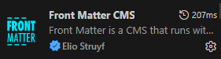
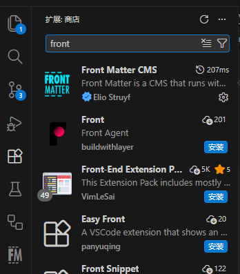
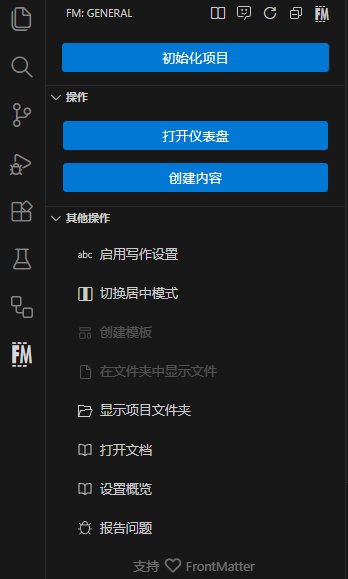
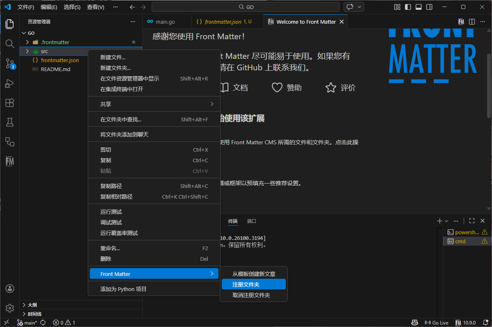
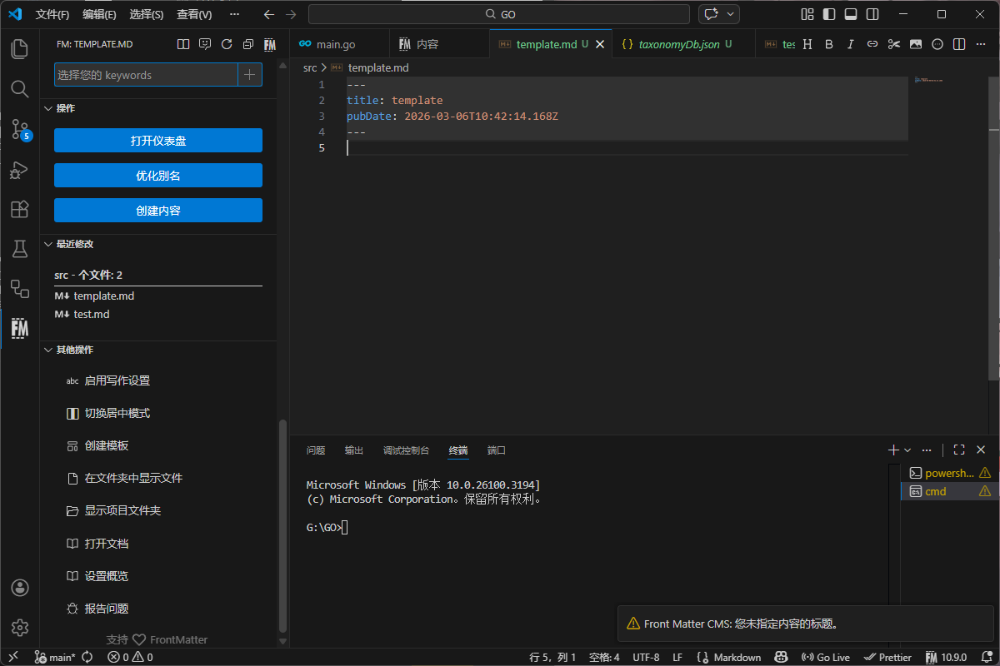
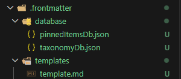
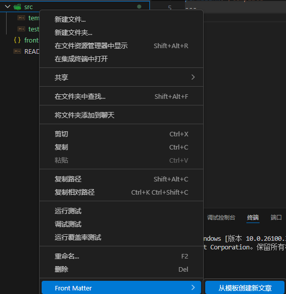

博客写作中，多用Markdown格式来撰写文章，而Front Matter是Markdown文件开头的一段YAML格式的元数据，用于描述文章的标题、日期、标签等信息。频繁编写Front Matter可能会比较麻烦，所以，vscode有一些插件可以帮助我们自动生成Front Matter，提高写作效率。

# 插件介绍
本文使用的插件为Front Matter CMS，可以通过在vscode插件市场搜索安装，可以控制一个完整的内容管理系统而无需使用服务器，网站或API，直接在VSCode中创建和管理内容。

:::note
本文仅介绍用于自动生成Front Matter的功能，多余内容请自行参阅[插件官网](https://frontmatter.codes/ "官网跳转")。
:::

# 使用方法
## 安装插件
在vscode中打开插件市场，搜索“Front Matter CMS”，点击安装即可。安装结束后可在侧边栏看到插件图标。

## 插件初始化
在安装结束后打开插件，会看到如下的界面，点击初始化项目出现新界面，点击初始化项目项目便会初始化。

此时可选择你的博客框架进行架构预设，一般会自动选中用于博客写作的文件夹，如果不存在，可以右键文件夹选择`front matter:注册文件夹`来注册文件夹。然后可以可选的从已有内容构建模板。

## 模板构建
不失一般性的，此处对于不存在已有内容的博客进行讲解，再次点击插件图标，选择创建内容，按照指引命名，即可生成一个初始文件，文件中会包含一些默认的Front Matter字段，如标题、日期、标签等。你可以根据需要修改这些字段的值，或者添加更多的字段来满足你的需求。

完成初始文件设置之后，在插件的其他操作界面可以找到创建模板的选项，正常命名之后模板就创建成功了。之后在创建内容的时候就可以选择使用这个模板了。模板存储在`.frontmatter/templates`文件夹下，可以根据需要修改模板内容来满足不同类型文章的需求。

## 博客文章书写
在之前注册的文件夹中右键选中`Front Matter:从模板创建新文章`，选择之前创建的模板，输入文章标题，即可生成一个包含Front Matter的Markdown文件。你可以根据需要修改Front Matter中的字段值，或者添加更多的字段来满足你的需求。

# 总结
使用vscode插件自动生成Markdown文章的Front Matter可以大大提升写作效率，减少重复劳动。通过安装和使用Front Matter CMS插件，你可以轻松创建和管理你的博客内容，让写作变得更加便捷和高效。如果你还没有尝试过这个插件，不妨安装一下。